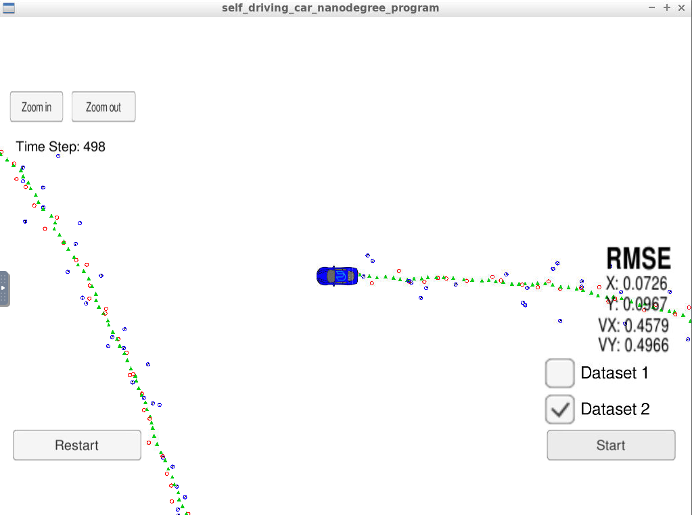

# SDC-ExtendedKalmanFilter

My own Project from SDC Udacity Course (Project 5). This code implements a Observator/Extended Kalman Filter to predict and update the position of a car.
An Kalman Filter is not enough because the radar sensor input is nonlinear, because of that Extended Kalman Filter has to linearize the measurements using 1st Order Taylor.

1. Readme
2. FusionEKF class: This class implements Extended Kalman Filter for radar and laser sensors. 
3. kalman_filter class: This class implements general equation for kalman filter and extended kalman filter.
4. tools class: This class calculares RSME and Jacobian for EKF.

## RSME using both sensor

## RSME using only Laser sensor

## RSME using only Radar sensor

